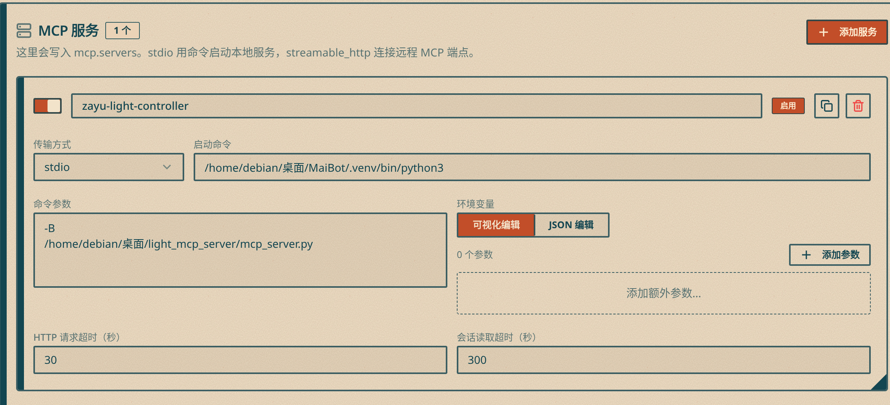

#  一个简单的mcp控制示例

- 杂鱼lava出品

包含mcp server和向串口发送信息的脚本，esp32烧录程序部分非常简单此处不再单独列出

MCP Server 暴露两个工具：

- `zayu_light_on`：调用插件内串口控制代码，向 ESP32 发送 `0`
- `zayu_light_off`：调用插件内串口控制代码，向 ESP32 发送 `1`

MaiBot 需要在 `config/bot_config.toml` 的 `mcp.servers` 中配置该服务，并在重启后生效。

### 使用方法

克隆此项目并安装pyserial,此处建议使用[uv](https://docs.astral.sh/uv/)安装依赖

```
uv pip install pyserial
```

在maibot内部配置mcp server,图示为示例，将此mcp的实际位置填入即可


